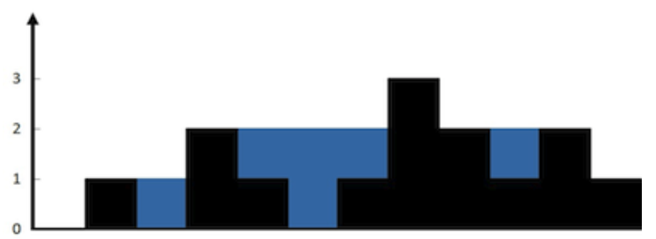

### 代码随想录刷题笔记

一刷中：2022.10.10

------

#### I. 数组

#### 1. 二分查找

该类问题分为两种场景：

- 简单二分查找：数组有序，并且数组中无重复元素，存在两种模板：

  - 第一种[left, Right]，这种好理解，常用这种

    ```java
    public int search(int[] nums, int target) {
        int left = 0 , right = nums.length - 1;
        while (left <= right){
            int mid = (right - left) / 2 + left;
            if(nums[mid] == target){
                return mid;
            }else if(nums[mid] < target){
                left = mid + 1;
            }else {
                right = mid - 1;
            }
        }
        return -1;
    }
    ```

  - 第二种[left, Right)

    ```java
    public int search2(int[] nums, int target) {
        int left = 0 , right = nums.length;
        while (left < right){
            int mid = (right - left) / 2 + left;
            if(nums[mid] == target){
                return mid;
            }else if(nums[mid] < target){
                left = mid + 1;
            }else {
                right = mid;
            }
        }
        return -1;
    }
    ```

- 二分查找左右界：数组有序，但是有重复元素，寻找target的最小（大）下标

  寻找下标的时候会出现三种情况：

  - nums = {5, 7, 7, 8, 8, 10}， target = 4or12，即target不在nums区间内，返回-1

  - nums = {5, 7, 7, 8, 8, 10}， target = 6，即target在nums区间内，但无匹配，返回-1
  - nums = {5, 7, 7, 8, 8, 10}， target = 8，返回3

  这里以寻找左边界为例，寻找右边界同理

  ```java
      public int getLeftBorder(int[] nums, int target) {
          int left = 0, right = nums.length - 1, res = -1;
          while(left <= right){
              int mid = (right - left) / 2 + left;
              //[5, 7, 7, 7, 8, 8, 10] l = 0 , r = 6 , m = 3 , tar = 7
              //由于要找左边界，所以nums[m] == tars时还要继续寻找左区间，故r = m - 1
              if(nums[mid] >= target){
                  //因为要寻找左边界，需要更新right，寻找左区间
                  right = mid - 1;
                  res = right;
              }else {
                  left = mid + 1;
              }
          }
          if(res + 1 >= 0 && res + 1 <= nums.length - 1 && nums[res + 1] == target){
              return res + 1;
          }else {
              return -1;
          }
      }
  ```


#### 2. 常用方法

##### 2.1 二分法

使用场景：给出一组有序的数组，**根据条件寻找某个（些）元素**

一般可以用二分法加速元素的查询，时间复杂度O(n^2)

##### 2.2 双指针

使用场景：**删除数组中的元素**，要求空间复杂度为O(1)

利用双指针，left指针为要覆盖的位置，right为探索指针，寻找位置为符合要求的元素，将right位置上的元素赋值给left位置，后移指针

##### 2.3 滑动窗口

使用场景：**寻找满足条件的子数组**

利用双指针确定一个窗口，通过双指针的移动，实现滑动窗口，在窗口不断的滑动（扩大并缩小）寻求满足条件的子数组

#### II. 链表

链表一般设计到一下几类题型：

- 移除链表元素：可以利用迭代以及递归的方式实现

- 设计链表：该链表可以满足在任意位置添加节点，删除指定val的节点

  - 可以通过单链表或双向链表作为底层数据结构
  - 单链表：实时维护链表的长度size，用于判定index合法性
  - 双向链表：空间换时间，维护一个头节点一个尾节点，可以根据index的位置从头或尾进行遍历，加快查询速率

- 翻转链表

  - 利用栈实现

    ```java
    	public ListNode reverseList(ListNode head) {
            Stack<ListNode> stack = new Stack<>();
            ListNode newRoot = new ListNode(0);
            ListNode temp = newRoot;
            while(head != null){
                stack.add(head);
                head = head.next;
            }
            while(!stack.isEmpty()){
                temp.next = stack.pop();
                temp = temp.next;
            }
            //不加这句会导致循环链表
            //在栈中的节点next会保存之间的next，需要初始化
            temp.next = null;
            return newRoot.next;
        }
    ```

  - 迭代方法

    ```java
    	public ListNode reverseList2(ListNode head) {
            ListNode cur = head;
            ListNode pre = null;
            while(cur != null){
                //需要暂存一下cur的下一个节点
                ListNode next = cur.next;
                //翻转指针
                cur.next = pre;
                //后移pre以及cur
                pre = cur;
                cur = next;
            }
            return pre;
        }
    ```

  - 递归方法

    ```java
    	public ListNode reverseList3(ListNode head) {
            if(head == null || head.next == null){
                return head;
            }
            ListNode newRoot = reverseList3(head.next);
            //l1 -> l2 翻转为 l1 <- l2
            head.next.next = head;
            //去引用，初始化
            head.next = null;
            return newRoot;
        }
    ```

- 两两交换链表中的节点

  - 可以通过迭代和递归的方式解决，核心代码类似于翻转链表

- 删除链表中的倒数第N个节点

  - 该类问题可以用**双指针**解决，具体思路为：first指针与second指针相隔n个距离，后同时移动双指针，当first遍历到尾部时，second.next位置即为删除位置

    ```java
    public ListNode removeNthFromEnd2(ListNode head, int n) {
            ListNode newRoot = new ListNode(-1);
            newRoot.next = head;
            ListNode first = head;
            ListNode second = newRoot;
            for(int i = 0; i < n; i++){
                first = first.next;
            }
            while(first != null){
                first = first.next;
                second = second.next;
            }
            second.next = second.next.next;
            return newRoot.next;
        }
    ```

- 寻找两链表相交的首节点

  - 该类问题可以用**双指针**解决，设立双指针分别指向headA与headB，指针tempA遍历完headA，再遍历headB；同时，指针tempB遍历完headB，再遍历headA，当指针重合时，即重合点

  - 理论：设headA链表长a，headB链表长b，重合部分长c；则 a + (b - c) = b + (a - c)

    ```java
    	public ListNode getIntersectionNode2(ListNode headA, ListNode headB) {
            ListNode tempA = headA, tempB = headB;
            while(tempA != tempB){
                tempA = tempA == null ? headB : tempA.next;
                tempB = tempB == null ? headA : tempB.next;
            }
            return tempA;
        }
    ```

- 环形链表：寻找环入口

  - 该类问题可以用**双指针**解决，算法流程为：

    - 寻找第一次相遇位置（若有环存在）
    - slow继续从相遇位置移动，fast从链表头移动，同时一个一个移动，相遇位置为环入口

    ```java
    	public ListNode detectCycle3(ListNode head) {
            ListNode fast = head, slow = head;
            while(true) {
                if(fast == null || fast.next == null) {
                    return null;
                }
                fast = fast.next.next;
                slow = slow.next;
                if(slow == fast) break;
            }
            fast = head;
            while(slow != fast){
                slow = slow.next;
                fast = fast.next;
            }
            return fast;
        }
    ```


#### III. 哈希表

一般哈希表用来快速判断一个元素是否出现在集合中

- 用数组作为哈希表：一般常见于与单词有关的场景中，因为申请数组的长度是确定有界的
- 用set作为哈希表：如果题目中没有限制数值的大小，且有重复的元素那么可以使用set集，但是set只能存储一个key
- 用map作为哈希表：kv结构

##### 1. 常见题型

- 异位词相关题目：可以利用长度为26的数组作为哈希表，记录字母出现的个数
- 数组交集：由于数组中元素可能会重复，则可以使用set集
- n数之和：
  - 二数之和：利用hash表存储已访问过的元素，查询会降低到O(1)
  - 三数之和：先排序，确定第一个数，后利用双指针头尾逼近寻找剩余两个数O(n^2)
  - 四数之和：先排序，确定第一个数以及第二个数，后用双指针头尾逼近寻找剩余两个数O(n^3)
- 快乐数：利用hash表存储已经出现过的数，若循环到出现过的数那么一定不是快乐数

#### IV. 栈与队列

##### 1. 栈

要充分利用其后进先出的特性

经典题目：

- 括号匹配问题
- 字符串去重问题：可以利用StringBuilder模拟栈
- 逆波兰表达式：利用数组代替栈

注意很多问题使用java中已经封装好的stack会比较浪费时间，可以利用数组、StringBuilder等去模拟栈操作，实现空间时间加速

##### 2. 队列

队列问题一般多出现为优先队列，即小顶堆或大顶堆，可以利用堆实时维护k个符合要求的元素，降低时间复杂度

经典题目：

- 滑动窗口最大值
  - 维护大顶堆，在大顶堆中记录元素的值以及索引，在判定最大值过期时，可以利用索引以及当前窗口位置判定
  - 维护单调栈，更加节省空间，添加元素时，删除比该元素小的元素
- 求K个高频元素：实际上就是求前k个最大值问题
  - 首先利用Hash表记录元素出现的频次，将该问题转化为求前k个最大值问题，判定当前元素个数与堆顶元素个数的关系来维护大小为k的小顶堆

#### V. 二叉树

##### 1. 遍历方式

**深度优先遍历**：前序遍历、中序遍历、后序遍历

- 递归方式：中序遍历为例

  ```java
  		public List<Integer> inorderTraversal(TreeNode root) {
          List<Integer> ans = new ArrayList<>();
          DFS(root, ans);
          return ans;
      }
  
      public void DFS(TreeNode node, List<Integer> ans) {
          if(node == null) return;
  
          DFS(node.left, ans);
          ans.add(node.val);
          DFS(node.right, ans);
      }
  ```

- 迭代方式：借助栈实现迭代，类似于回溯

  ```java
  		//入栈顺序：左到右
  		public List<Integer> inorderTraversal(TreeNode root) {
          List<Integer> ans = new ArrayList<>();
          if(root == null) return ans;
          Stack<TreeNode> stack = new Stack<>();
          TreeNode cur = root;
          while(cur != null || !stack.isEmpty()) {
              if(cur != null) {
                  stack.add(cur);
                  cur = cur.left;
              }else {
                  cur = stack.pop();
                  ans.add(cur.val);
                  cur = cur.right;
              }
          }
          return ans;
      }
  ```

**广度优先遍历：**层序遍历

```java
		public List<List<Integer>> levelOrder(TreeNode root) {
        List<List<Integer>> ans = new ArrayList<>();
        if(root == null) return ans;
        Queue<TreeNode> queue = new LinkedList<>();
        queue.add(root);
        while(!queue.isEmpty()) {
            int len = queue.size();
            List<Integer> list = new ArrayList<>();
            while(len > 0) {
                len--;
                TreeNode cur = queue.poll();
                list.add(cur.val);
                if(cur.left != null) {
                    queue.add(cur.left);
                }
                if(cur.right != null) {
                    queue.add(cur.right);
                }
            }
            ans.add(list);
        }
        return ans;
    }
```

##### 2. 二叉树的属性

- 二叉树是否对称

- 最大深度

- 最小深度

- 完全二叉树节点个数，性质：

  - 若height(left) == height(right)，说明左子树已满，个数为2 ^ height(left) - 1，再计算右子树个数即可
  - 若height(left) != height(right)，说明右子树已满，个数为2 ^ height(right) - 1

- 判断是否为平衡二叉树

  - 自顶向下递归：

    ```java
    		public boolean isBalanced(TreeNode root) {
            if(root == null) {
                return true;
            }else {
                return Math.abs(height(root.left) - height(root.right)) <= 1 && isBalanced(root.left) && isBalanced(root.right);
            }
        }
    
        public int height(TreeNode root) {
            if(root == null) {
                return 0;
            }else {
                return Math.max(height(root.left), height(root.right)) + 1;
            }
        }
    ```

  - 自底向上递归：

    ```java
    		public boolean isBalanced2(TreeNode root) {
            return getHeight(root) >= 0;
        }
    
        public int getHeight(TreeNode root) {
            if(root == null) return 0;
            int leftHeight = getHeight(root.left);
            int rightHeight = getHeight(root.right);
    
            //若该节点的左右子树已经不满足平衡二叉树，或自己已经不符合则直接返回-1
            if(leftHeight == -1 || rightHeight == -1 || Math.abs(leftHeight - rightHeight) > 1) {
                return -1;
            }else {
                return Math.max(leftHeight, rightHeight) + 1;
            }
        }
    ```

- 二叉树所有路径：递归，先序遍历

  - 注意java中传引用，对于集合数据结构需要回溯

- 左子叶之和：层序遍历，后序遍历

- 二叉树左下角的值：层序遍历，递归先左后右

- 二叉树路径总和

##### 3. 二叉树的修建与构造

- 翻转二叉树
- 构造二叉树：给出中序遍历以及前/后序遍历，构造二叉树
  - 基于前/后序遍历，确定根节点，切分中序遍历，递归构造
- 构造最大二叉树
- 合并两个二叉树

##### 4. BST的属性

- 二叉搜索树的搜索：按性质迭代搜索即可，迭代方式类似于链表移动指针
- 是否为二叉搜索树：
  - 按照性质：中序遍历为单调递增序列
  - 递归设置范围，超出范围则不为BST
- 二叉搜索树的最小绝对差：中序遍历
- 二叉搜索树的众数：中序遍历
- 二叉搜索树转为累加树：反序中序遍历

##### 5. 二叉树公共祖先问题

##### 6. 二叉搜索树的修改与构造

- 插入操作：迭代、递归

- 删除操作：寻找目标节点，针对四种情况进行删除

  ```java
  //找到目标节点，准备删除
  if(root.val == key) {
      //1. 如果该节点是叶子结点，直接删除
      if(root.left == null && root.right == null) {
      return null;
      }
      //2. 左叶子树为空，则删除后只剩下右子树
      if(root.left == null) {
      return root.right;
      }
      //3. 右子树为空，则删除后只剩下左子树
      if(root.right == null) {
      return root.left;
      }
      //4. 如果删除的节点存在左右子树
      TreeNode successor = root.right;
      while(successor.left != null) {
      successor = successor.left;
      }
      //删除successor，因为successor已经移动到根节点，不应该存在在root.right中
      root.right = deleteNode(root.right, successor.val);
      successor.right = root.right;
      successor.left = root.left;
      //删除了当前root节点，将successor作为当前新根
      return successor;
  }
  ```

- 修剪操作：根据上下限以及性质分条件遍历

- 构建二叉搜索树：每次寻找有序序列中间部分作为根，切分序列，分别进行递归

#### VI. 单调栈

一般题意为：寻找任意元素左或右第一个比其大（小）的元素，即可想到用单调栈进行解决

- 每日温度_739：寻找第一个较大元素的位置，维护下标单调递减栈
- 下一个更大元素I_496：寻找下一个更大元素，维护单调递减栈
- 下一个更大元素II_503：在循环队列中寻找下一个更大元素，遍历两遍即可
- 接雨水_42：
  - 
  - 维护下标单调递减栈，遍历数组，对于当前元素：
    - 若当前元素高于栈顶元素，且栈中元素至少有两个，则可以得到接雨水的区域。该区域的宽度为：（当前高度对应下标 - 距栈顶第二个元素下标 - 1），该区域的高度为（当前元素与第二个元素的高度最小值）- 栈顶高度
    - 将当前栈顶元素出栈，继续比较栈顶元素，以此类推
- 柱状图最大矩形_84：
  - 维护下标单调递增栈，以栈顶元素的高度为基准，当前元素小于栈顶元素，则为右边下一个更小元素；栈顶下一个元素，则为左边下一个更小元素

#### VII.回溯

##### 1. 使用场景

回溯算法能解决如下问题：

- 组合问题：N个数里面按一定规则找出k个数的集合
- 排列问题：N个数按一定规则全排列，有几种排列方式
- 切割问题：一个字符串按一定规则有几种切割方式
- 子集问题：一个N个数的集合里有多少符合条件的子集
- 棋盘问题：N皇后，解数独等等

##### 2. 回溯模版

不同题目，对参数传递、终止条件、剪枝处理都不同

- 递归版

  ```java
  public void backtrack(int index) {
  		if(index == n) {
        	ans.add(new ArrayList(temp));
        	return;
      }
    	//选择当前位置，继续递归遍历下一位
    	temp.add(ans[index]);
    	backtrack(index + 1);
    	
    	//不选择该位置，继续递归下一位
    	temp.remove(temp.size() - 1);
    	backtrack(index + 1);
  }
  ```

- 递归迭代版：递归纵向遍历、for循环横向遍历

  ```java
  public void backtrack(int index) {
  		if(index == n) {
        	ans.add(new ArrayList(temp));
        	return;
      }
    	//控制树的横向遍历
    	for(int i = 0; i < n; i++) {
        	//选择当前位置，继续递归遍历下一位
    			temp.add(ans[index]);
        	//控制树的纵向遍历，根据要求是否继续遍历i 或者 i + 1
    			backtrack(i + 1);
    			//不选择该位置，继续递归下一位
    			temp.remove(temp.size() - 1);
      }
  }
  ```

##### 3. 组合问题

- 简单组合_77：选择1-n范围内k个数的组合

  - 注意剪枝：temp 长度加上区间 [cur, n] 的长度小于 k，不可能构造出长度为 k 的 temp

- 组合总和I_39：找出candidates中可以使数字和为目标数target 的 所有不同组合

  - 注意剪枝：总和超出target或索引位置index越界

- 组合总和II_40：找出candidates中可以使数字和为目标数target 的 所有不同组合，**candidates中存在重复序列**

  - 首先对序列进行排序，保证相同的数都在一起，

  - 创建used数组，用于记录该位置是否被选择过，used[i - 1] == false，说明同一树层candidates[i - 1]使用过，直接跳过

  - 

  - ```java
    public void backtrack(int[] candidates, int target, int sum, int begin) {
        if(sum == target) {
            ans.add(new ArrayList<>(temp));
            return;
        }
        for(int i = begin; i < candidates.length; i++) {
            //如果当前相同，且前一个树枝上未取过，则代表马上该树层要取，这样会出现重复，则需跳过
            //即前一个选了，当前也可以选；前一个未选，当前也不能选
            if(i > 0 && candidates[i] == candidates[i - 1] && !used[i - 1]) {
                continue;
            }
            if(sum + candidates[i] <= target) {
                used[i] = true;
                temp.add(candidates[i]);
                backtrack(candidates, target, sum + candidates[i], i + 1);
                used[i] = false;
                temp.remove(temp.size() - 1);
            }
        }
    }
    ```

- 组合总和III_216：找出所有相加之和为 n 的 k 个数的组合，注意剪枝：

  - temp 长度加上区间 [cur, n] 的长度小于 k，不可能构造出长度为 k 的 temp
  - cur不能大于9

- 多集合求组合_17：求不同集合之间的组合

##### 4. 子集问题

- 子集问题_78：给定一个数组，返回其中所有的子集

- 子集问题II_90：给定一个数组，数组中存在重复元素，返回其中所有的子集

  - 和上面的重复问题一样，设定used数组记录前面的节点是否被访问，若为nums[i] == nums[i - 1] && !used[i - 1]跳过即可

  - ```java
    		public void backtrack(int[] nums, int index) {
            ans.add(new ArrayList<>(temp));
          	if(index >= nums.lenght) {
              	return;
            }
            for(int i = index; i < nums.length; i++) {
                if(i > index && nums[i] == nums[i - 1] && !used[i - 1]) continue;
                temp.add(nums[i]);
              	used[i] = true;
                backtrack(nums, i + 1);
              	used[i] = false;
                temp.remove(temp.size() - 1);
            }
        }
    ```

- 递增子序列_491：找到所有该数组的递增子序列，长度至少为2，数组中元素可重复

  - 同样，同层的重复数不可以选

  - 在递归时，判断当前的元素与前一元素的大小，以及当前元素是否被用过，如果小于前面的值或者被用过，都需要跳过

  - ```java
    private void backtrack2(int[] nums, int start) {
            if (temp.size() > 1) {
                //这里不用return，因为需要继续记录后续节点
                ans.add(new ArrayList<>(temp));
            }
    
            int[] used = new int[201];
            for (int i = start; i < nums.length; i++) {
                if (!temp.isEmpty() && nums[i] < temp.get(temp.size() - 1) || (used[nums[i] + 100] == 1)) 						{
                    continue;
                }
                used[nums[i] + 100] = 1;
                temp.add(nums[i]);
                backtrack2(nums, i + 1);
                temp.remove(temp.size() - 1);
            }
        }
    ```

##### 5. 排列问题

- 排列问题_46：给定一个 没有重复 数字的序列，返回其所有可能的全排列

  - 排序问题注意序列内是有顺序的，即[1,2]与[2,1]是不同的
  - 在递归时需要判断当前的元素是否在temp中出现过，若出现过，则跳过

- 排序问题II_47：给定一个 存在重复 数字的序列，返回其所有可能的全排列

  - 和前面的重复问题一致，即同一层不能选择相同的数，维护used数组记录前面的元素是否选过即可

  - 即当前已经选过 或者 与前一个元素相同并且前一个元素未选，则跳过

  - ```java
    		public void backtrack(int[] nums, List<Integer> temp) {
            if(nums.length == temp.size()) {
                ans.add(new ArrayList<>(temp));
                return;
            }
      
            for(int i = 0; i < nums.length; i++) {
                //上一位置选择了，那么可以继续选；如果未选择，那么当前也不能选
                //因为在同一层，前面的遍历已经选择前面的数了
                //看一下代码随想录的图解，结合当前层和上一层理解
                if(visit[i] || (i > 0 && nums[i] == nums[i - 1] && !visit[i - 1])) {
                    continue;
                }
                temp.add(nums[i]);
                visit[i] = true;
                backtrack(nums, temp);
                visit[i] = false;
                temp.remove(temp.size() - 1);
            }
        }
    ```

##### 6. 棋盘问题

- n皇后问题_51：创建三个集合，分别记录在列以及两个方向斜线上的已经存在皇后的位置；依次尝试填入，并回溯即可
- 数独问题_37：使用三个集合分别记录同一行、同一列、同一九宫格出现的数字；依次尝试填入，并回溯

#### VIII. 贪心

- 存在局部最优推出全局最优就可以用贪心解决，一般举不出反例都可以先用贪心试试

- 存在两个维度互相影响的情况，同时考虑会顾此失彼，可以贪心的先选择一个维度，后确定另一个维度

  - 分糖果_135：两次遍历，先考虑左到右，再考虑右到左，最终取最大值
  - 根据身高重建队列_406：
    - 贪心思路：先考虑高度，按照高度从大到小排序，后根据排位依次插入即可
    - 解释：因为后插入的元素比之前的元素低，所以可以随便插入不会影响原数组的排列

- 贪心解决区间类问题：

  - 跳跃问题_45：跳到末尾用最少的跳跃次数

    - 动态维护end最大右边界

    - ```java
      		public int jump(int[] nums) {
              int length = nums.length;
              //利用end边界维护当前能到的最大位置，到达边界时跳跃次数+1
              int end = 0;
              int maxPosition = 0;
              int steps = 0;
              //最后一个位置无需遍历
              for (int i = 0; i < length - 1; i++) {
                  maxPosition = Math.max(maxPosition, i + nums[i]);
                  if (i == end) {
                      end = maxPosition;
                      steps++;
                  }
              }
              return steps;
          }
      ```

  - 重叠区间数量_452：按左边界排序，不断缩小区间，若下一个左边界不在最小右边界中，则加一

  - 无重叠区间_435：排序，发现重复区间，删除较大右边界的元素

  - 划分字符空间_763：统计各字符出现的最后位置，维护最大右边界

  - 合并区间_56：排序，取最小左边界以及最大右边界

#### IX. 动态规划

如果问题存在很多重复子问题，那么可以使用动态规划，动态规划中每一个状态一定是由上一个状态推导出来的

##### 1. 解题步骤

- 确定dp数组以及下标的含义
- 确定递推公式
- dp数组的初始化
- 确定遍历顺序
- 举例推导dp数组

##### 2. 经典题目

**基础题目**


**背包问题**

**0-1背包理论基础**

问题：有n件物品和一个最多能背重量为w 的背包。第i件物品的重量是weight[i]，得到的价值是value[i] 。**每件物品只能用一次**，求解将哪些物品装入背包里物品价值总和最大


**二维dp**

- `dp[i][j]` 表示在 0 - i 个物品以及背包容量为j的情况下的最大价值
- 存在两种情况：对于i物品是否取
  - 不取（背包容量不足）：`dp[i][j] = dp[i - 1][j] `
  - 取：`dp[i][j] = dp[i - 1][j - weight[i]] + value[i]`
    - 寻找之前背包容量为 j - weight[i] 的时候的最大值，再加上当前的物品
    - 并与背包容量为j时未取当前物品做比较（和他上面的值比较），选取大的
  - 递归公式：`dp[i][j] = Max(dp[i - 1][j], dp[i - 1][j - weight[i]] + value[i])`

- 初始化：

  

  - `dp[i][0] = 0` 表示如果背包为0，则放不下任何东西，则最大价值为0
  - `dp[0][j]` 对于第一个物品存在取（能取）与不取（容量不足）
    - 当 j < weight[i]时，`dp[0][j] = 0`
    - 当 j >= weight[i]时， `dp[0][j] = value[i] `

- 遍历顺序：先遍历物品，再遍历背包

- 模拟：

  

代码实现：

```java
		public int getMaxValue(int[] weight, int[] value, int w) {
        int n = weight.length;
        int m = w;
        int[][] dp = new int[n][m + 1];
        //初始化
        for(int i = 0; i < n; i++) {
            dp[i][0] = 0;
        }
        for(int j = 0; j <= m; j++) {
            if(j >= weight[0]) {
                dp[0][j] = value[0];
            }
        }
        System.out.println("init: ");
        System.out.println(Arrays.deepToString(dp));
        for(int i = 1; i < n; i++) {
            for(int j = 1; j <= m; j++) {
                if(weight[i] > j) {
                    dp[i][j] = dp[i - 1][j];
                }else {
                    dp[i][j] = Math.max(dp[i - 1][j], dp[i - 1][j - weight[i]] + value[i]);
                }
            }
        }
        System.out.println("dp: ");
        System.out.println(Arrays.deepToString(dp));
        return dp[n - 1][m];
    }
```

**一维dp**

**如果把dp[i - 1]那一层拷贝到dp[i]上，表达式完全可以是：`dp[i][j] = max(dp[i][j], dp[i][j - weight[i]] + value[i])`**

- `dp[j]:` 容量为j的背包能背的最大价值
- `dp[j] = max(dp[j], dp[j - weight[i]] + value[i])`
- `dp[0] = 0`
- 遍历顺序与二维不同，对于背包需要倒序遍历，对于物品正序遍历，并且先遍历物品后遍历背包

代码实现：

```java
public class BagProblem2 {

    public int getMaxValue(int[] weight, int[] value, int w) {
        int n = weight.length;
        int[] dp = new int[w + 1];
        dp[0] = 0;
        for(int i = 0; i < n; i++) {
            for(int j = w; j >= weight[i]; j--) {
                dp[j] = Math.max(dp[j], dp[j - weight[i]] + value[i]);
            }
        }
        return dp[w];

    }

    public static void main(String[] args) {
        int[] weight = {1, 3, 4};
        int[] value = {15, 20, 30};
        int k = 4;
        System.out.println(new BagProblem2().getMaxValue(weight, value, k));
    }
}
```

**完全背包**

有N件物品和一个最多能背重量为W的背包。第i件物品的重量是weight[i]，得到的价值是value[i] 。**每件物品都有无限个（也就是可以放入背包多次）**，求解将哪些物品装入背包里物品价值总和最大，下例：背包的空间为4


**与01背包不同的地方是遍历顺序，完全背包由于可以重复放，所以对于背包的遍历为从小到大**

- 在01背包中由于对于物品，只能选择一次，所以对于背包必须倒序遍历


**打家劫舍**


**股票问题**


**子序列问题**


#### X. 图论

##### 1. 最小生成树

有两种最小生成树算法：

- Kruskal算法
- Prim算法

**Kruskal算法：**

算法步骤：
*         将边按照权值依次从小达到排列
*         依次将边所关联的节点加入维护的图中，若存在环，则丢弃该边
          *         这一步可以通过**并查集**的方式实现
*         直到全部节点加入到图中

示例：

```java
public class Kruskal {
    public static int[] parent = new int[4];

    public Integer findRoot(Integer NodeId) {
        if(NodeId == parent[NodeId]) {
            return NodeId;
        }else {
            return parent[NodeId] = findRoot(parent[NodeId]);
        }
    }

    /**
     * 合并函数：如果两个点不存在关联关系，则将其合并，并返回true
     * 反之，返回false
     * @param nodeId1
     * @param nodeId2
     * @return
     */
    public boolean unionRoot(Integer nodeId1, Integer nodeId2) {
        int root1 = findRoot(nodeId1);
        int root2 = findRoot(nodeId2);
        if(root1 != root2) {
            parent[root1] = root2;
            return true;
        }
        return false;
    }

    public Integer kruskal(List<Edge> edges, Integer nodeCnt) {
        Integer minSum = 0;
        //最终形成的最小生成树中只能有 nodeCnt - 1 条边
        Integer edgeCnt = nodeCnt - 1;
        Collections.sort(edges, new Comparator<Edge>() {
            @Override
            public int compare(Edge o1, Edge o2) {
                return Integer.compare(o1.getValue(), o2.getValue());
            }
        });

        for(Edge edge : edges) {
            //如果加入节点后不产生环，则累加边权值
            if(unionRoot(edge.getFrom(), edge.getTo())) {
                //System.out.println(Arrays.toString(parent));
                minSum += edge.getValue();
                edgeCnt--;
            }
            //所有节点均加入图中，无需判断后续的边了，直接退出即可
            if(edgeCnt == 0) {
                break;
            }
        }
        return minSum;
    }


    public static void main(String[] args) {
        Edge edge1 = new Edge(1, 2, 1);
        Edge edge2 = new Edge(2, 3, 2);
        Edge edge3 = new Edge(3, 1, 4);

        //init
        for(int i = 1; i <= 3; i++) {
            parent[i] = i;
        }

        List<Edge> edges = new ArrayList<>();
        edges.add(edge1);
        edges.add(edge2);
        edges.add(edge3);

        Kruskal kruskal = new Kruskal();
        System.out.println(kruskal.kruskal(edges, 3));

    }

}

class Edge {
    private Integer from;
    private Integer to;
    private Integer value;

    public Edge(Integer from, Integer to, Integer value) {
        this.from = from;
        this.to = to;
        this.value = value;
    }

    //getter、setter
}
```

##### 2. 单源点最短路径

对于网中的任意两个顶点（例如顶点 A 到顶点 B）来说，之间的最短路径不外乎有 2 种情况：

1. 直接从顶点 A 到顶点 B 的弧的权值为顶点 A 到顶点 B 的最短路径；
2. 从顶点 A 开始，经过若干个顶点，最终达到顶点 B，期间经过的弧的权值和为顶点 A 到顶点 B 的最短路径。

**核心思想：**插点

​	对于从顶点 A 到顶点 B 的最短路径，拿出网中所有的顶点进行如下判断：

```
Dis（A，K）+ Dis（K，B）< Dis（A，B）
```

​	判断经过顶点 K 是否存在一条可行路径比直达的路径的权值小，如果式子成立，说明确实存在一条权值更小的路径，此时只需要更新记录的权值和即可。

**示例：**有向无向均可以判断

```java
/*
* Floyd算法解决单源点最短路径问题：
*   算法步骤：
*       1. 初始化距离矩阵
*       2. 依次判断两个节点中是否存在加入一个点使得距离变得更小，若存在则更新距离
* */
public class Floyd {
    public static Integer nodeCnt = 5;

    public int[][] floyd(int[][] graph) {
        int[][] distant = Arrays.copyOf(graph, graph.length);

        for(int k = 1; k <= nodeCnt; k++) {
            for(int i = 1; i <= nodeCnt; i++) {
                for(int j = 1; j <= nodeCnt; j++) {
                    distant[i][j] = Math.min(distant[i][j], distant[i][k] + distant[k][j]);
                    //System.out.println("distant[" + i + "][" + j + "] : " + distant[i][j]);
                }
            }
        }
        return distant;
    }

    public static void main(String[] args) {
        int[][] graph = new int[nodeCnt + 1][nodeCnt + 1];
        graph[1][3] = 4;
        graph[3][1] = 4;
        graph[4][3] = 2;
        graph[3][4] = 2;
        graph[1][2] = 3;
        graph[2][1] = 3;
        graph[5][4] = 2;
        graph[4][5] = 2;
        graph[3][5] = 6;
        graph[5][3] = 6;

        for(int i = 1; i <= nodeCnt; i++) {
            for(int j = 1; j <= nodeCnt; j++) {
                if(graph[i][j] == 0) {
                    graph[i][j] = Integer.MAX_VALUE / 2;
                }
                if(i == j) {
                    graph[i][j] = 0;
                }
            }
        }

        Floyd floyd = new Floyd();
        int[][] floyd1 = floyd.floyd(graph);

        for(int i = 1; i <= nodeCnt; i++) {
            for(int j = 1; j <= nodeCnt; j++) {
                System.out.print(floyd1[i][j] + " ");
            }
            System.out.println();
        }
    }
}

```

